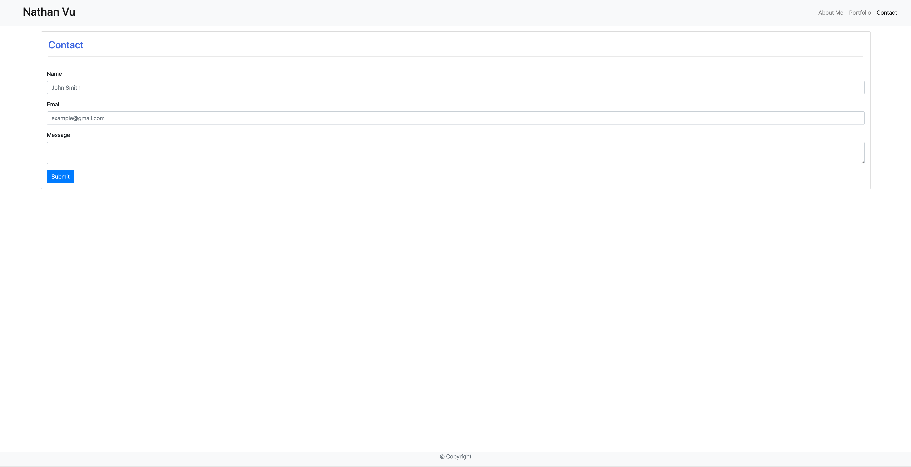
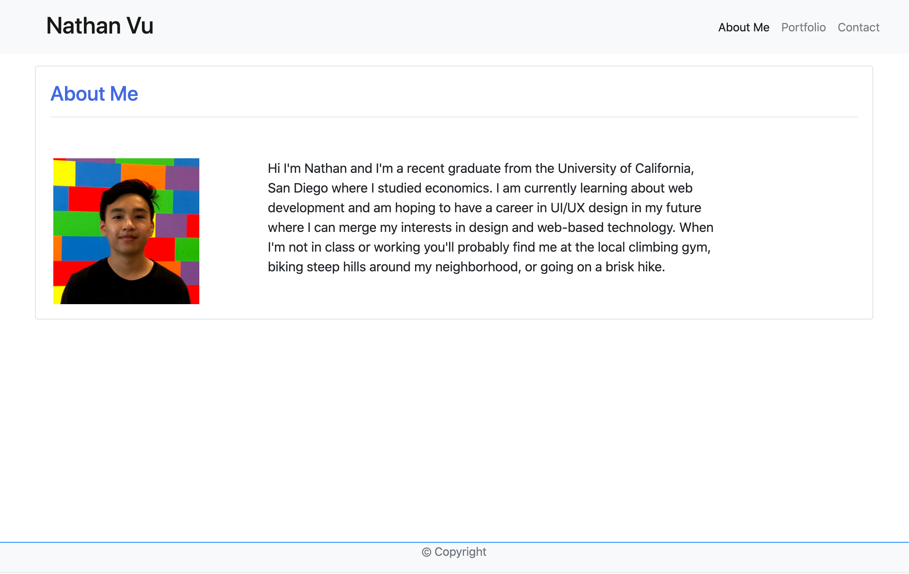
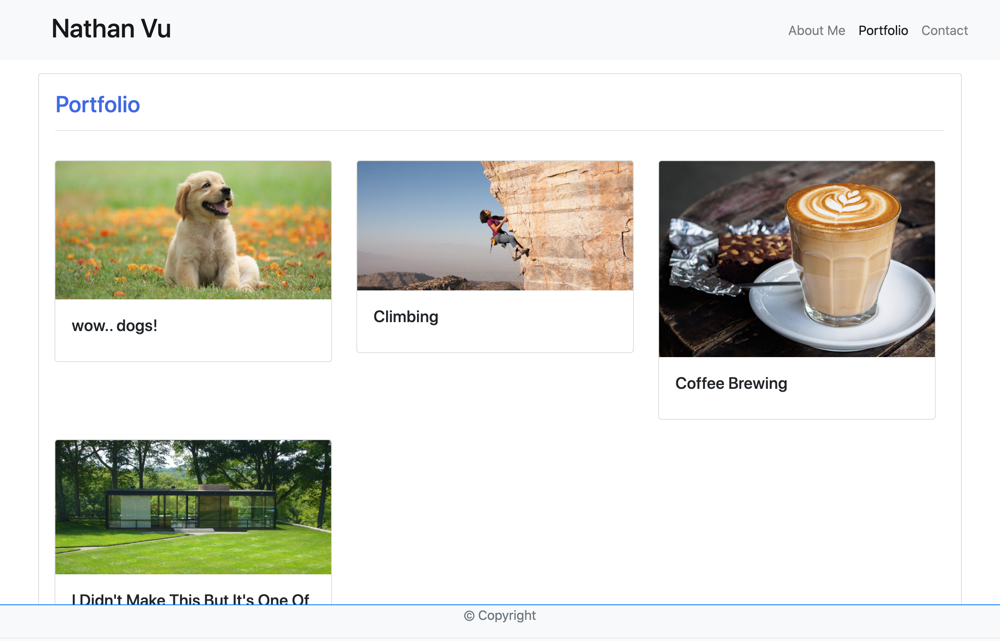
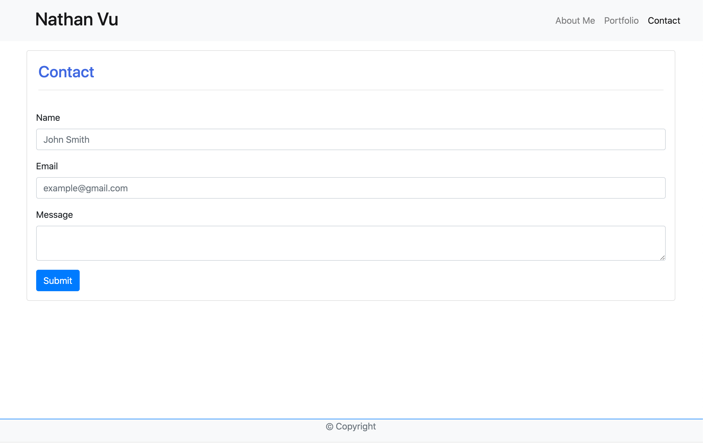
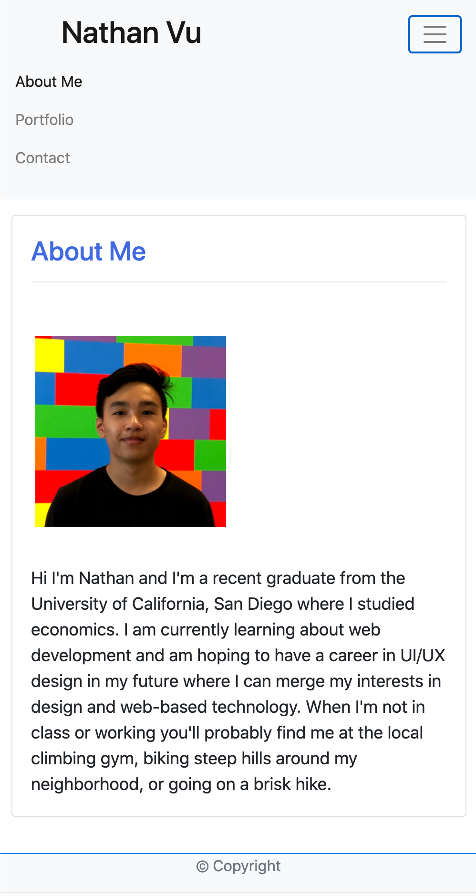
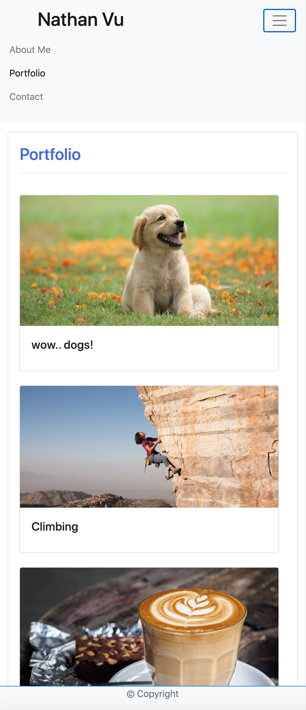
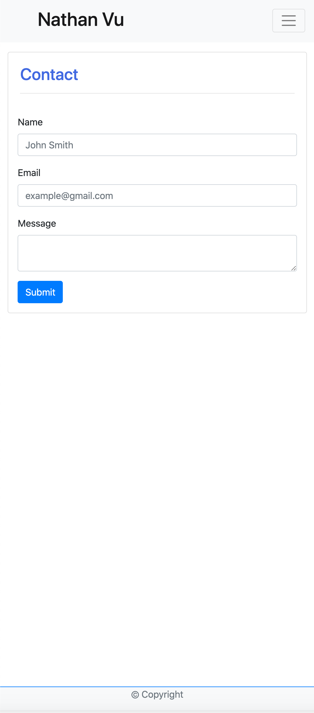

# New Portfolio

## Description

This is my new updated portfolio purely utilizing the Bootstrap CSS design library. The purpose of this website was mainly to fiddle around with Bootstrap in order to create a response portfolio webpage. It utilizes mostly default components given on Bootstrap with minor adjustments in regards to formatting elements of the webpage. The forms and cards on the page are not functional as of 9/16 but maybe in the future. Navbar will redirect to different pages of the website all utilizing the same card size to contain the information on the page. 

## Usage

Using the deployed link for the website will allow the viewer to navigate around my Bootstrap portfolio and test the responsive webpage by resizing the window. 

Here are some screenshots of the webpage at various sizes.
Full-screen:

Medium-sized:

Small-sized:

## Built With

* HTML
* CSS
* Javascript

## Deployed Link

https://nathanmvu.github.io/new-portfolio/

## Authors

* **Nathan Vu**

- [Link to Github](https://github.com/nathanmvu)
- [Link to LinkedIn](https://www.linkedin.com/in/nathan-vu/)

## License

This project is licensed under the MIT License 

